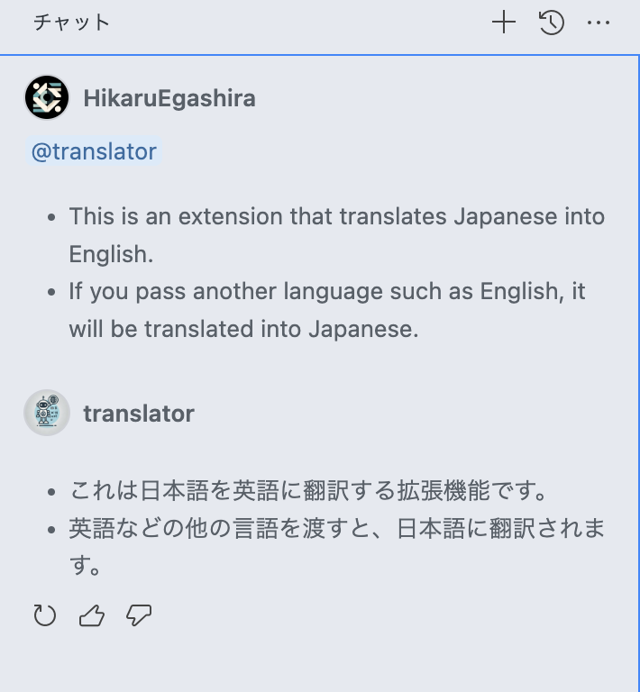

# VSCode Chat Extension for Translate

- This is an extension that translates Japanese into English.
- If you pass another language such as English, it will be translated into Japanese.

> - 日本語を英語に翻訳する拡張機能です。
> - もしも英語など他の言語を渡した場合は、その言語を日本語に翻訳します。

[GitHub Copilotを独自に拡張し翻訳ツールにした - Zenn](https://zenn.dev/sqer/articles/964e3bc24b5448)

## Development

- Run `npm install` in terminal to install dependencies
- Run the `Run Extension` target in the Debug View. This will:
	- Start a task `npm: watch` to compile the code
	- Run the extension in a new VS Code window

> - ターミナルで `npm install` を実行して依存関係をインストールします
> - デバッグビューで `Run Extension` ターゲットを実行します。これにより:
> 	- コードをコンパイルするためのタスク `npm: watch` が開始されます
> 	- 新しい VS Code ウィンドウで拡張機能が実行されます
